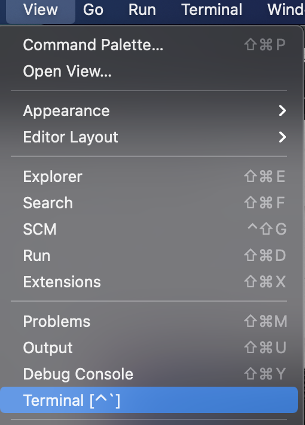

# Team-A-Agile

## Table of Contents
- Setup Instructions
    - Backend Setup
    - Frontend Setup
- Testing Instructions

## Setup Instructions

### Backend Setup
For the backend you will need to install Intellij Community Edition if you don't already have it. Here is a link to the download page:

- [Intellij Download](https://www.jetbrains.com/idea/download/#section=mac)

You will then need to open the JavaWebService file in Intellij which is in:

 Team-A-Agile/backend

Once the project is opened the pom.xml file will run and install the necessary dependencies. If it doesn't then open this file in the editor and relode it by clicking the cycling arrow on the top right.

You will need to create a file called "config.properties" in the resource folder to hold your database credentials. The resource folder is located in:

src/main

Inside config.properties copy/paste the code below and replace the placeholder data with your own.

```
driver: placeholder
username: placeholder
password: placeholder
url: placeholder
```

Next you will need to click on the drop-down menu in the top right next to the green hammer and click 'Edit Configurations'


A menu will popup and in the 'program arguments' field enter in "server" click 'apply' then 'ok'.

You should be able to now run the backend by clicking the green arrow in the top right.

---

### Frontend Setup

For the frontend you will need to install Microsft Visual Studio Code.

- [Microsft Visual Studio Code download](https://code.visualstudio.com/?wt.mc_id=vscom_downloads)

You will then need to open the 'frontend' file located in the root directory.

In the 'frontend' folder create a file called ".env". Inside it copy/paste the code below replacing the 'placeholder' with the port number of the backend api. Make sure to save the file once added.

```
API_URL=http://localhost:placeholder/api
```

Open the terminal in VScode by going to 'View' -> 'Terminal'


On the command line type "npm install"

Then once the packages have installed type "npm start".

You now should be able to go to the localhost url, replace placeholder with your port number: http://localhost:placeholder/
