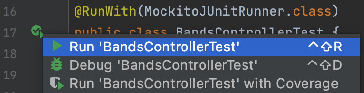

# Team-A-Agile

## Table of Contents
- [Setup Instructions](#setup-instructions)
    - [Backend Setup](#backend-setup)
        - [Java SDK](#java-sdk)
        - [Intellij](#intellij)
    - [Viewing Backend](viewing-backend)
    - [Frontend Setup](#frontend-setup)
        - [Microsoft Visual Studio](#microsoft-visual-studio)
- [Testing Instructions](#testing-instructions)
    - [Unit Tests](#unit-tests)
    - [Cucumber Tests](#cucumber-tests)

## Setup Instructions

### Backend Setup

####  **Java SDK**
This project requires Java JDK version 16:
- [JDK 16 Download](https://www.oracle.com/java/technologies/javase-jdk16-downloads.html)


####  **Intellij**
For the backend you will need to install Intellij Community Edition if you don't already have it. Here is a link to the download page:

- [Intellij Download](https://www.jetbrains.com/idea/download/#section=mac)

You will then need to open the JavaWebService file in Intellij which is in:

 Team-A-Agile/backend

Once the project is opened the pom.xml file will run and install the necessary dependencies. If it doesn't then open this file in the editor and reload it by clicking the cycling arrow on the top right.

1. You will need to create a file called "config.properties" in the resource folder to hold your database credentials. The resource folder is located in:

src/main

Inside config.properties copy/paste the code below and replace the placeholder data with your own.

```
driver: placeholder
username: placeholder
password: placeholder
url: placeholder
```
After that you need to open the terminal inside Intellij. Just click on the terminal tab at the bottom of the page. On the command line type:

```
npm clean install
```

2. Next you will need to click on the drop-down menu in the top right next to the green hammer and click 'Edit Configurations'


A menu will popup and in the 'program arguments' field enter in "server" click 'apply' then 'ok'.

You should be able to now run the backend by clicking the green arrow in the top right.

---

### Viewing Backend

With the backend running you should be able to view various requests to the database server by going to:

http://localhost:8080/api

You can view specific calls by changing what comes after api such as:

http://localhost:8080/api/bands


---

### Frontend Setup

####  **Microsoft Visual Studio**

For the frontend we recommend you use Microsoft Visual Studio Code.

- [Microsoft Visual Studio Code download](https://code.visualstudio.com/?wt.mc_id=vscom_downloads)

1. Open the frontend folder

2. In the root of the frontend folder create a file called ".env". 
	
	+-- frontend
	|   +-- .env
	
	3. Inside the .env file, copy the code below replacing the 'placeholder' with the port number of the backend api. Make sure to save the file once added.
```
API_URL=http://localhost:placeholder/api
```

Open the terminal in VScode by going to 'View' -> 'Terminal'

On the command line type:
```
npm install
```

Then once the packages have installed type:
```
npm start
``` 
Once both the frontend and the backend are running you can view the frontend.

To view the frontend, follow this link: http://localhost:6555/

---

## Testing Instructions

### Unit Tests

The unit tests are located in the backend folder under:

backend/JavaWebService/src/test/java

These also depend on the pom.xml file to load the dependencies correctly.

Each Java Class file tests a single controller of the project with multiple tests inside each.
In order to run these tests just left click the green arrow next to the class name and run the test.



If you want to run all of the Unit tests, type in the terminal:
```
mvn clean install
```
---

### Cucumber Tests

You will need chromedriver installed:

- [Download](https://chromedriver.chromium.org/downloads)

The Selenium tests which interact with the frontend application are located in the 'integration' folder in the root directory.

Open this folder in Intellij. This folder also has a pom.xml file which you will most likely have to reload. This will make sure the dependencies are loaded.

In order to run a test, you will first have to make sure both the backend api and the frontend are running and routing correctly. Make sure that your .config and .env files have the right information.

Once both of those applications are running you can run all of the cucumber tests by going to:

/src/test/java/integration/RunCucumberTest.java

Then left click on the green arrow to the left of the class name and run the tests.

This will create an instance of Chrome which will open the website and navigate through the pages.